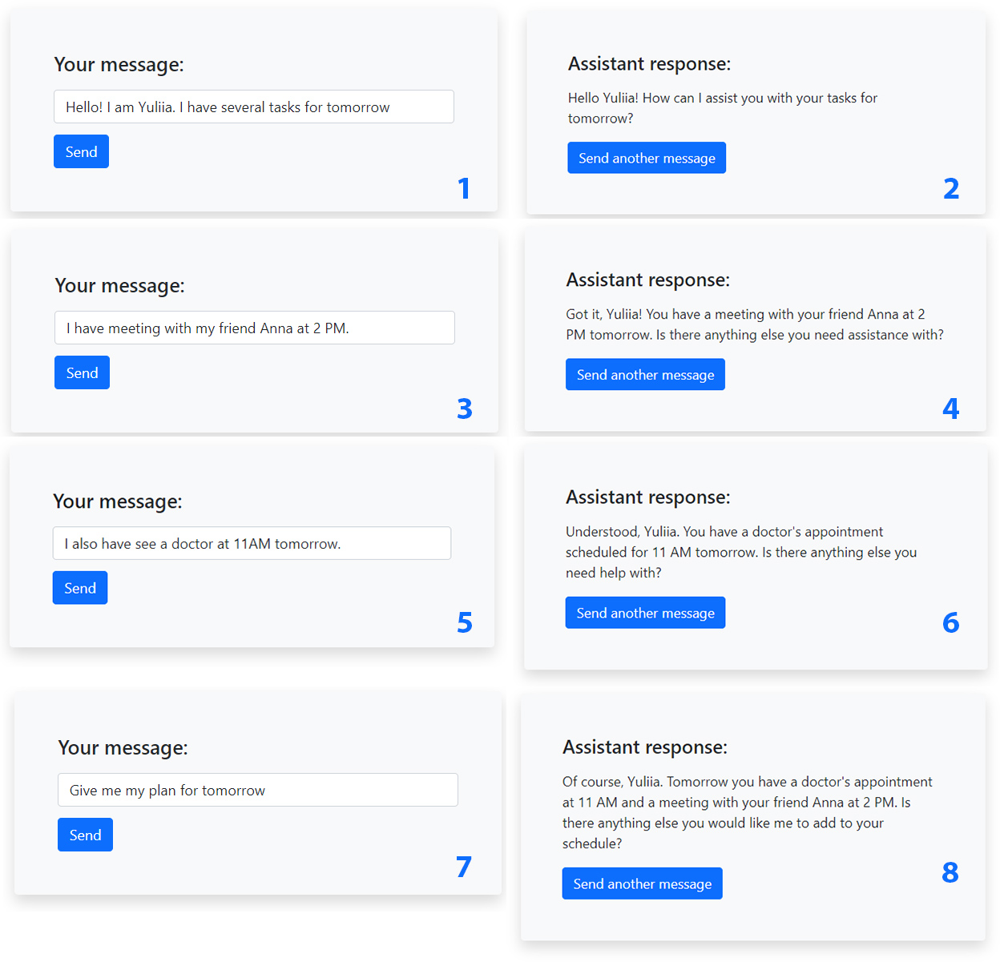

# AI Assistant with Memory

Flask-based application to interact with AI assistant. It remembers the previous conversation
and use it as a context.

Technologies used:

* LangChain framework.
* OpenAI API (`gpt-3.5-turbo` model).
* Chroma vector database to save the conversation.

## How to run

1. Clone the project and create virtual environment.
```shell
git clone https://github.com/yuliia-stopkyna/ai-assistant.git
cd ai-assistant
python -m venv venv
source venv/bin/activate # on MacOS
venv\Scripts\activate # on Windows
pip install -r requirements.txt
```

2. Create `.env` file with OpenAI Api Key (look at `.env.sample` file)
3. Run the app.
```shell
flask run
```

## Conversation example

